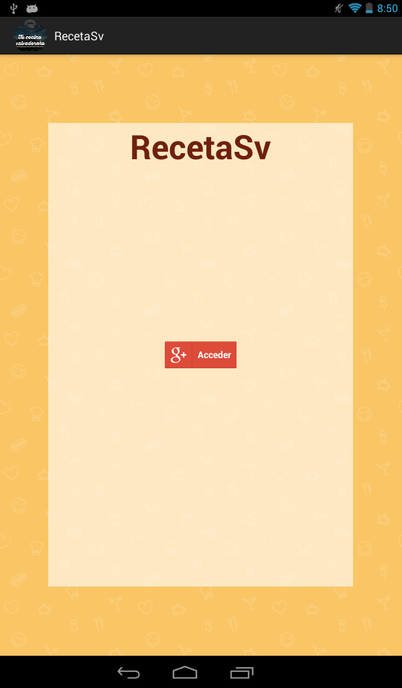
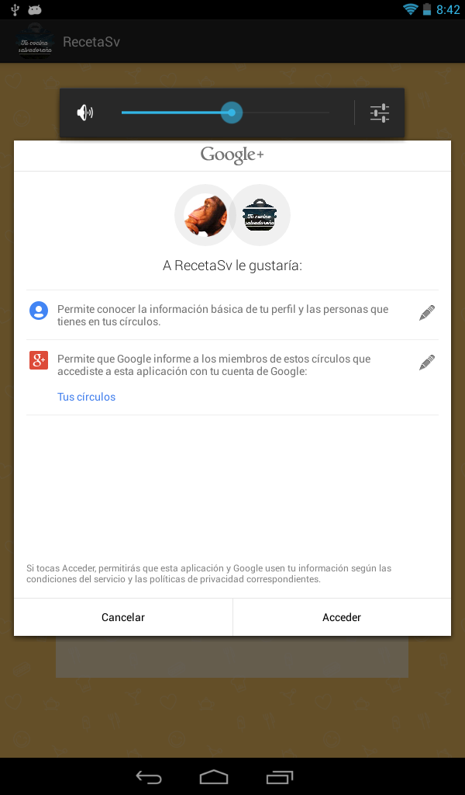
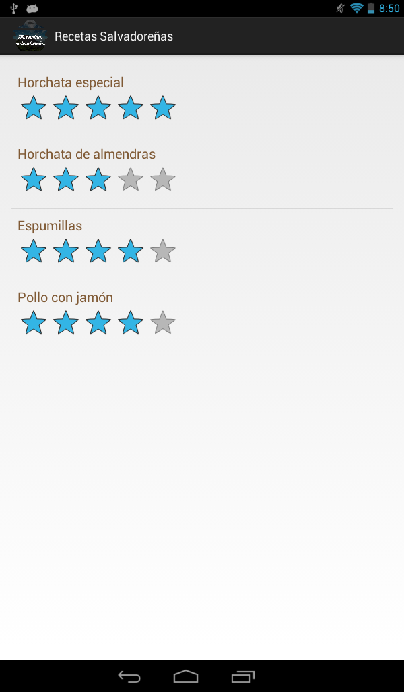
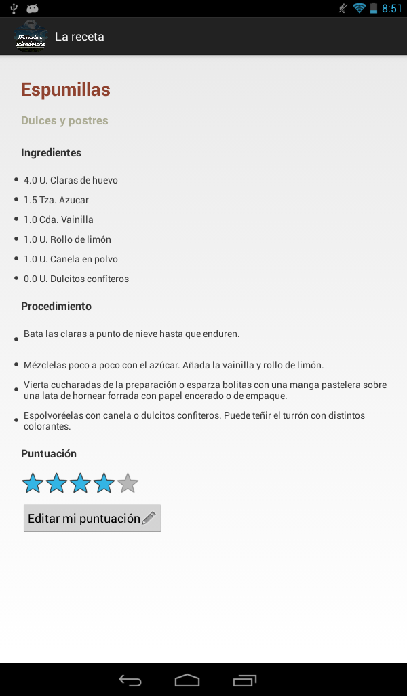

SamplesAPK
==========

Repositorio de aplicaciones de android con el proposito de practicar

#Aplicacion de recetas salvadore&ntilde;as

Aplicacion que muestra una lista de recetas y permite ver detalle de cada una y dar una puntuacion personal, se solicita permisos de datos publicos de gplus para efectuar dicha puntuacion.

Los datos de la aplicacion se obtienen de una API, se puede acceder al backend en esta direccion: [Backend](http://recetassv.herokuapp.com/) 

